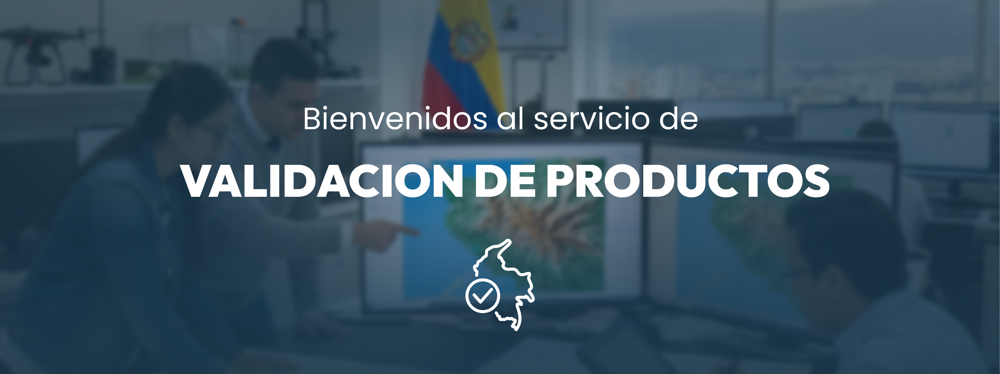

# ¿En qué consiste la Plataforma de Validación de Productos Cartográficos?

<figure><figcaption></figcaption></figure>

La Plataforma de Validación de Productos Cartográficos es una herramienta desarrollada por el IGAC que permite gestionar, de manera estructurada y eficiente, los resultados de la validación técnica de diferentes tipos de productos cartográficos, tales como:

* Modelos Digitales de Terreno (MDT)
* Ortoimágenes
* Bases de datos vectoriales

Esta plataforma facilita el cargue organizado de la información obtenida durante los procesos de validación y genera en tiempo real un concepto técnico basado en los criterios de calidad establecidos por el IGAC. Gracias a su diseño, el usuario puede realizar todo el proceso de forma sencilla, ágil y rápida, garantizando trazabilidad y estandarización.
