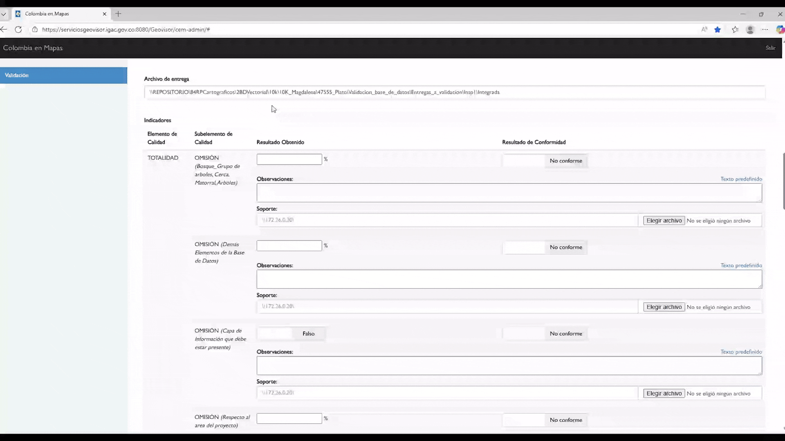

# Base Vectorial

<figure><figcaption></figcaption></figure>

El **Geo Visor de Validación** establece una estructura de informe rigurosamente estandarizada para cada categoría de producto geográfico. Cada ítem sujeto a evaluación incorpora un texto predefinido, diseñado para asegurar la uniformidad en la documentación, donde únicamente se requiere la sustitución de los valores faltantes.

Al acceder a la interfaz de validación, el sistema presenta un informe en blanco cuya estructura se encuentra establecida. Este se diligencia progresivamente a medida que se realiza la inspección y la verificación de los criterios de calidad correspondientes.

<em>Diligenciamiento del Informe de validación en Bases Vectoriales</em>

### Totalidad

El primer criterio de calidad que se somete a evaluación es la Totalidad. Este concepto fundamental se desglosa en subelementos que cuantifican la Omisión (elementos faltantes) y la Comisión (elementos incorrectamente incluidos). Para una Base Vectorial, se inspecciona específicamente la totalidad para categorías como Bosque y cercas, los demás elementos de la Base de Datos, y la presencia de Capas de información requeridas, así como la cobertura respecto al área del proyecto. La plantilla del informe permite registrar y reemplazar los valores de resultado y el nivel de conformidad obtenidos para cada uno de estos ítems.

>)

<em>Diligenciamiento Elemento de calidad: Totalidad</em>

### Consistencia lógica

El segundo criterio de calidad esencial a evaluar es la Consistencia Lógica. Este criterio verifica que la estructura interna de la Base Vectorial se adhiera a las reglas de diseño preestablecidas. La inspección se divide en tres subelementos clave: Consistencia Conceptual o de Formato (evaluación de la estructura de la base de datos respecto al esquema oficial del IGAC), Consistencia Topológica (Análisis de las relaciones espaciales entre objetos) y Consistencia de Dominio (verificación de diligenciamiento de atributos de las tablas de los feature).

>)

<em>Diligenciamiento Elemento de calidad: Consistencia Lógica</em>

### Exactitud en posición

La Exactitud en Posición Relativa se evalúa mediante una metodología de muestreo espacial, que consiste en la definición y medición de puntos de verificación distribuidos de manera uniforme a lo largo del área del proyecto. La evaluación de este ítem es de gran importancia, ya que el valor máximo de error aceptable se determina en función de la escala cartográfica del producto. El informe documenta el error obtenido y se compara con el nivel de tolerancia estándar para determinar la conformidad.

<figure><figcaption></figcaption></figure>

<em>Diligenciamiento Elemento de calidad: Exactitud en Posición</em>

### Exactitud temática

La Exactitud Temática es el criterio que evalúa la veracidad del contenido descriptivo asociado a las entidades geográficas. Este se desglosa en tres subelementos esenciales: la Clasificación de los Elementos, la Exactitud de Atributos Cualitativos y la Exactitud de Atributos Cuantitativos.

>)

<em>Diligenciamiento Elemento de calidad: Exactitud Temática</em>

### Sistema de referencia

El elemento Sistema de Referencia constituye un requisito de conformidad obligatoria. Para todas las Bases Vectoriales, se debe verificar que el sistema de coordenadas horizontal utilizado corresponda con el estándar oficial MAGNA-SIRGAS 2018 Origen-Nacional. La validación de este ítem determina si el producto es técnicamente apto para su integración con el Marco Geocéntrico Nacional de Referencia.

<figure><figcaption></figcaption></figure>

<em>Diligenciamiento Elemento de calidad: Sistema de Referencia</em>

### Consistencia temporal

Posteriormente, se procede a evaluar la Consistencia Temporal de la Base Vectorial, verificando la vigencia y actualidad de los datos. La norma establece dos rangos de tolerancia: la información debe tener una antigüedad igual o inferior a tres (3) años para áreas de alta dinámica (urbana, infraestructura reciente) y se permite una antigüedad de hasta cinco (5) años para zonas con baja o nula dinámica inmobiliaria (zonas rurales remotas o áreas protegidas estables).

<figure><figcaption></figcaption></figure>

<em>Diligenciamiento Elemento de calidad: Consistencia Temporal</em>

### Formato

El siguiente elemento de evaluación es la Conformidad del Formato de Entrega y Despliegue. Este criterio asegura la interoperabilidad y la correcta integración de la Base Vectorial en los entornos de producción. Se requiere que el producto sea entregado en cualquiera de los siguientes formatos validados: XML, RDF, PostGIS+, PostgreSQL o GDB.

<figure><figcaption></figcaption></figure>

<em>Diligenciamiento Elemento de calidad: Formato de Entrega</em>

### Metadato

La evaluación final se centra en el Metadato del producto geográfico, el cual debe cumplir con los estándares normativos vigentes. Esta revisión se lleva a cabo mediante la Herramienta de Validación de Metadato, la cual inspecciona una serie de parámetros obligatorios. El resultado de esta verificación automatizada arroja un concepto final (Aprobado o No Aprobado).

<figure><figcaption></figcaption></figure>

<em>Diligenciamiento Elemento de calidad: Metadato</em>

### Observaciones finales

Para finalizar el informe, se diligencia la sección de Observaciones Generales y debe contener el concepto final de la validación. Además, esta sección debe incluir las rutas de acceso donde se dispone el producto validado y los resultados detallados de la inspección. Como anexos obligatorios, se deberá adjuntar la salida gráfica de localización del proyecto, y, en caso de haberse detectado inconsistencias, se deberá incluir la Geodatabase (GDB) de Inconsistencias para facilitar su ajuste.

<figure><figcaption></figcaption></figure>

<em>Diligenciamiento Elemento de calidad: Metadato</em>

